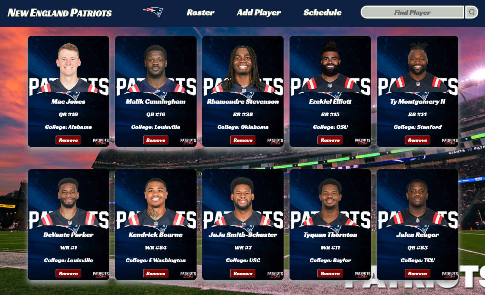

# NFL-Team-Tracker

NFL Team Tracker is a mock app where you can keep updates on your favorite team, for this demo I created a page for the New England Ptriots (25 players from the offense).

The user can use the navigation menu to update their team's current roster, depth chart, players' stats, and team schedule (wins/losses). The user will be able to change these items through interactive player cards and various update forms, depending on the item.

## Initial Process

With the idea of an NFL tracker, the initial data relationships can be observed in the following ERD.

## Project Requirements
1. The app must have 3 related data entities
2. Consistent and polished user interface
3. Full CRUD on all models across the Back End
4. At least 1 additional Create, Update, or Delete functionality on models across Front and Back End

## Languages & Database
