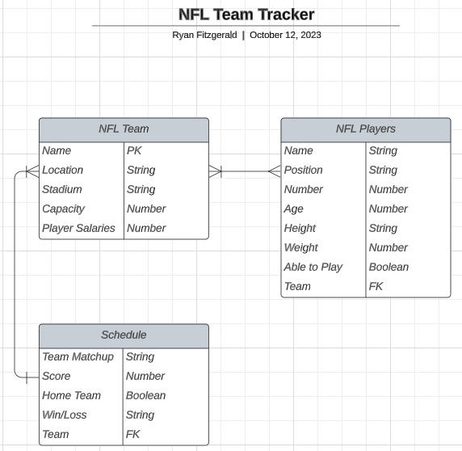
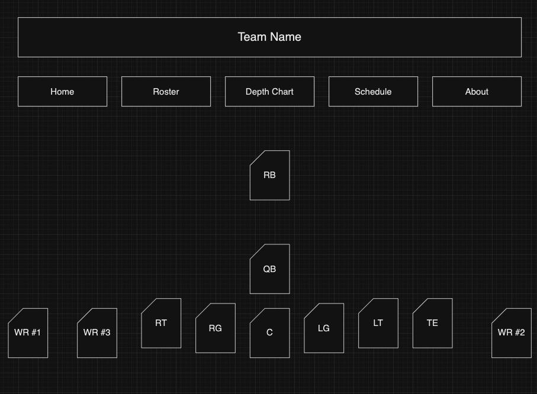

# NFL-Team-Tracker

NFL Team Tracker is a mock app where you can keep updates on your favorite team

The user can use the navigation menu to update their team's current roster, depth chart, players' stats, and team schedule (wins/losses). The user will be able to change these items through interactive player cards and various update forms, depending on the item.

## Initial Process

With the idea of an NFL tracker, the initial data relationships can be observed in the following ERD.

After the initial database, I created a wireframe design for the app layout

## Project Requirements
1. The app must have 3 related data entities
2. Consistent and polished user interface
3. Full CRUD on all models across the Back End
4. At least 1 additional Create, Update, or Delete functionality on models across Front and Back End

## Stretch Goals
1. Interactive player cards with animations for user updates
2. Automation after user updates (Ex: an injured starter should move to the end of the order, the backup would then become the starter)
3. Apply sounds/music to pages and buttons